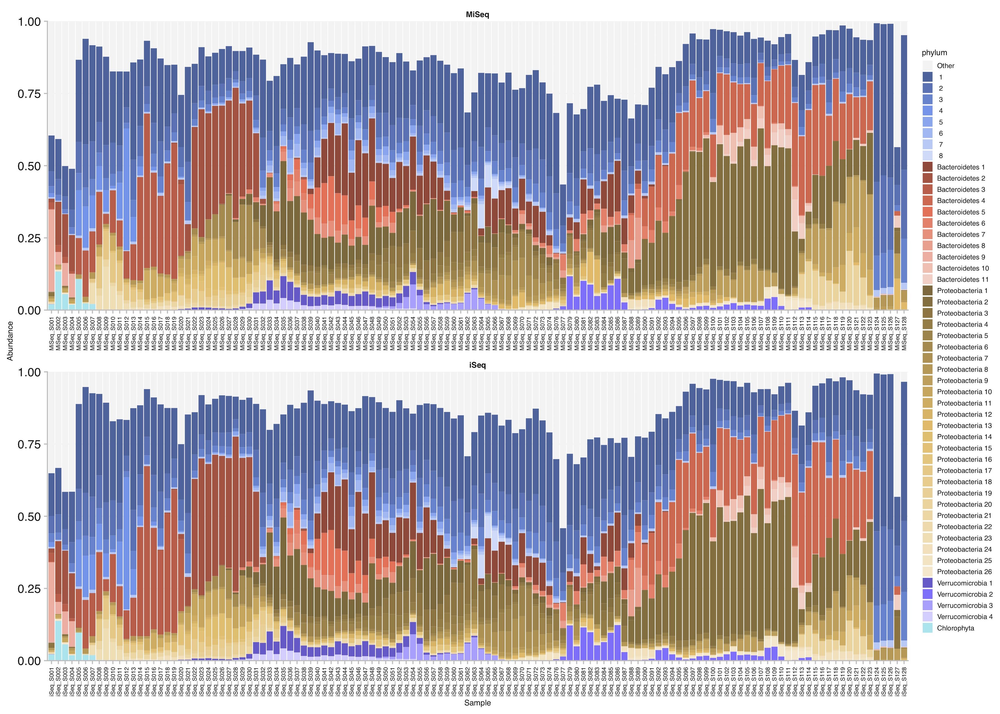
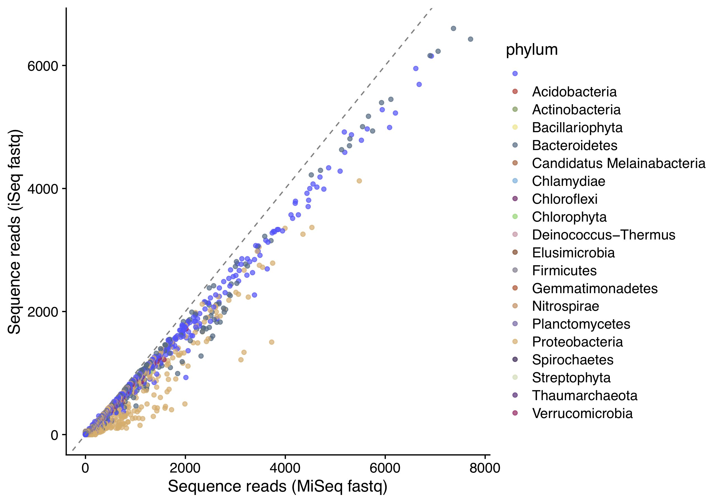
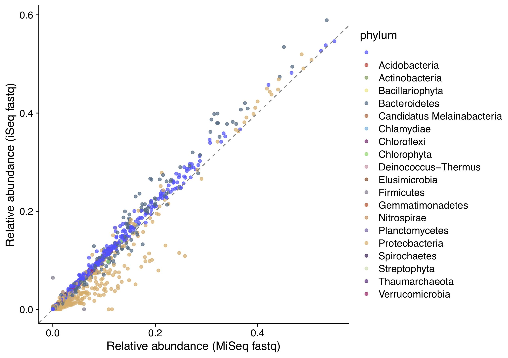

# Analyzing MiSeq and iSeq fastq files using DADA2
Both Illumina MiSeq and iSeq can generate sequences that are suitable for 16S rRNA amplicon sequence analysis.
However, fastq files that are generated by iSeq contain only three types of Q-scores, 11 (,), 25 (;) and 37 (F). In this folder, I briefly examined how these differences influence DADA2 sequence analysis.

# General procedure
0. Partial 16S rRNA sequences were amplified using 515F-806R, and the amplicons were sequenced by MiSeq V2 250 x 2 bp kit.
1. Started from MiSeq fastq files (0-39) (Example fastq files are in 02_DemultiplexedOut_MiSeqStyle). Note that, although I analyzed 252 fastq files (= 126 samples), only six fastq files are in 02_DemultiplexedOut_MiSeqStyle becuase the results have not been published yet (a preprint is available <a href="https://doi.org/10.1101/2020.04.08.032524" target="_blank">here</a>).
2. Manually converted MiSeq Q-scores to iSeq Q-scores using a shell script (Example fastq files are in 02_DemultiplexedOut_iSeqStyle).
3. These two types of fastq files were analyzed by the idential script using DADA2 ("03_SeqAnalysisDADA2_MiSeq.R" and "03_SeqAnalysisDADA2_iSeq.R").
4. Representative sequences were saved as "ASV.fa", and taxa information was assigned using Claident (<a href="https://doi.org/10.1371/journal.pone.0076910" target="_blank">Tanabe & Toju 2013 PLoS ONE</a>).
5. ASV table, sample information and taxa information were imported as phyloseq object.
6. Three types of visualizations were done: Barplots of MiSeq-style fastq and iSeq-style fastq (Figure 1), sequence reads of MiSeq-style v.s. iSeq-style fastq files (Figure 2) and relative abundance of MiSeq-style v.s. iSeq-style fastq files (Figure 3).

