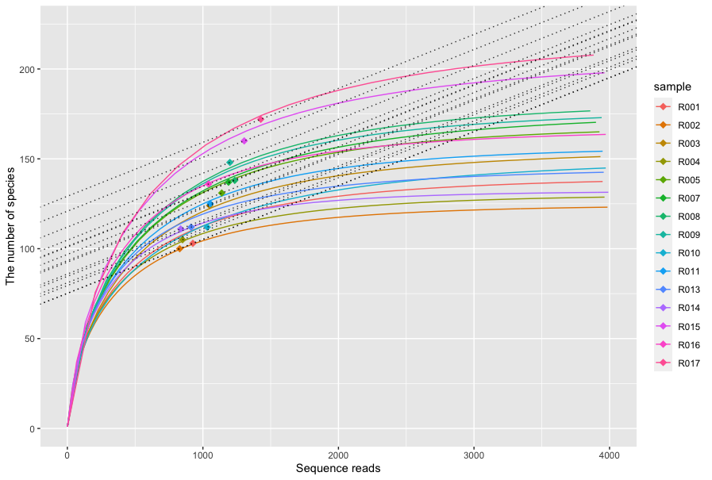

# A convenient function of coverage-based rarefaction and its visualization
This is a convenient function to perform coverage-based rarefaction. `phyloseq` object can be easily rarefied based on a user-specified coverage by executing the following command.

```{r}
ps_rare <- rarefy_even_coverage(ps_sample, coverage = 0.97, rarefy_step = 10)
```

In addition, results of the coverage-based rarefaction can be checked by visualizing the rarefaction curves.

```{r}
plot_rarefy(ps_sample, ps_rare)
```



For more detail, please run `demo_rarefy.R`.