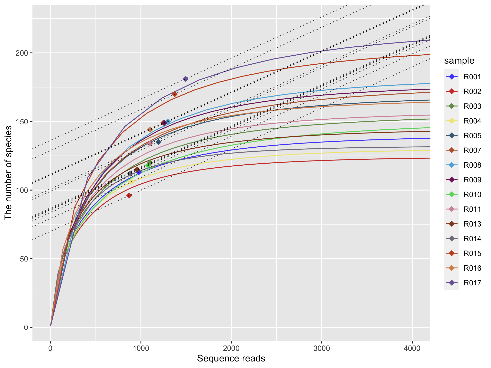

# `rarefy_even_coverage` 関数
`rarefy_even_coverage` は `phyloseq` オブジェクトをインプットとして、coverage-based rarefaction を行うための関数です。内部で `iNEXT` package と `phyloseq:::rarefaction_subsample` を利用して coverage-based rarefaction を実行します. `rarefy_even_coverage` 関数は `metagMisc` package の `phyloseq_coverage_raref` 関数と同様の結果を返します (https://github.com/vmikk/metagMisc). ただし、`phyloseq` オブジェクト内の分類群が行でも列でも (`taxa_are_rows = TRUE` or `taxa_are_rows = FALSE`) 使用可能です. さらに、`rarefy_even_coverage` 関数は rarefaction カーブの可視化のためのオブジェクトも返します.


## 実行例
```{r}
# OTU テーブルの rarefaction と可視化のためのオブジェクトを同時に返す
## include_iNEXT_results = TRUE とすると可視化のための計算を実行します
## OTU テーブルの rarefaction のみが必要であればここを FALSE とします
ps_rare_raw <- rarefy_even_coverage(ps_sample,
                                    coverage = 0.97,
                                    include_iNEXT_results = TRUE)

# phyloseq オブジェクトのみを抽出
ps_rare <- ps_rare_raw[[1]]                      

# 図示
plot_rarefy(ps_rare_raw)
```



詳しくは `demo_rarefy.R` を御覧ください.

## 実行例


# `rarefy_even_coverage` function
This repository includes convenient functions to perform coverage-based rarefaction. `phyloseq` object can be easily rarefied based on a user-specified coverage by the following command. Functions implemented in `iNEXT` package is used. `rarefy_even_coverage` returns identical results with `phyloseq_coverage_raref` function in `metagMisc`, but a phyloseq object with `taxa_are_rows = TRUE` or `taxa_are_rows = FALSE` is accepted. In addition, `rarefy_even_coverage` returns a rarefaction curve for visualization.


```{r}
# Calculate rarefied matrix and rarefaction curve simultaneously
ps_rare_raw <- rarefy_even_coverage(ps_sample,
                                    coverage = 0.97,
                                    include_iNEXT_results = TRUE)
# Extract phyloseq object
ps_rare <- ps_rare_raw[[1]]                      
```

In addition, results of the coverage-based rarefaction can be checked by visualizing the rarefaction curves.

```{r}
plot_rarefy(ps_rare_raw)
```


For more detail, please run `demo_rarefy.R`.