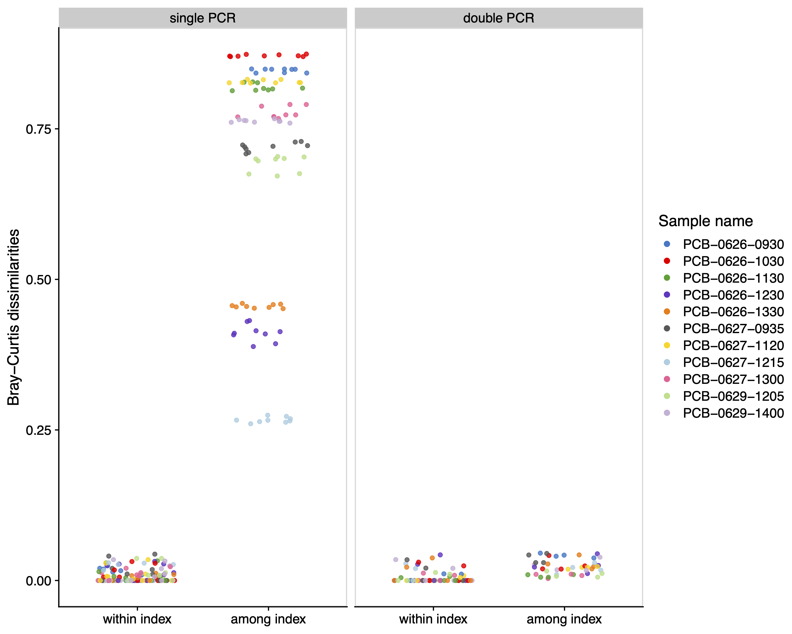

# Codes to reproduce and reanalyze data from O'Donnell et al (2016) _PLoS ONE_
This repository includes R and shell codes to reproduce and reanalyze data from O'Donnell et al. (2016) _PLoS ONE_ (https://doi.org/10.1371/journal.pone.0148698). Some metadata can be downloaded from https://journals.plos.org/plosone/article?id=10.1371/journal.pone.0148698#sec009. Sequence data can be downloaded from Dryad (https://datadryad.org/stash/dataset/doi%253A10.5061%252Fdryad.mp040).

## Note
- The analysis procedure is not identical with that of the original one, so the results may be quantitatively different from the original ones.
- The data was analyzed as follows:
    1. Sequence data demultiplexing using `cutadapt`
    2. Denoising using `dada2` (ASV approach)
    3. Re-clustering using `DECIPHIER` (97% OTU)
    4. Taxa assignment by `Claident` (a conservative QCauto method)
    5. Result visualization using `ggplot2`
- In general, `dada2` should be performed for each run, but all runs (maybe, five runs?) were simultaneously processed. This would probably not significantly change the results. 
- Detailed information about the packages is available in `00_SessionInfo` folder.

## Results
Figure 2, one of the main results, in O'Donnell et al. (2016) was successfully reproduced.

